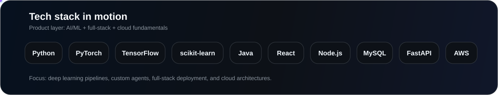

  

   
    

  
  
  

   
   

  
  
  

  

  

### Recruiter Snapshot

<table>
  <tr>
    <td width="50%" valign="top">
      <strong>What I build</strong> 
      ML-enabled web apps, timetable optimizers, prediction systems, email automation tools, and database-backed Java applications.
    </td>
    <td width="50%" valign="top">
      <strong>Current direction</strong> 
      Turning AI and ML coursework into deployable products with clean APIs, usable frontends, and measurable project outcomes.
    </td>
  </tr>
  <tr>
    <td width="50%" valign="top">
      <strong>Strengths</strong> 
      Python, Java, React, Node.js, MySQL, Flask, scikit-learn, AWS fundamentals, and practical full-stack delivery.
    </td>
    <td width="50%" valign="top">
      <strong>Looking for</strong> 
      Internship and campus opportunities where I can contribute to AI, web, data, or software engineering teams.
    </td>
  </tr>
</table>

### Tech Stack In Motion

  
   
  

### Featured Build Signals

  
  
  
  

  
<strong>Project map</strong>

   
  <table>
    <tr>
      <th align="left">Project</th>
      <th align="left">Signal for recruiters</th>
      <th align="left">Stack</th>
    </tr>
    <tr>
      <td><a href="https://github.com/santhosh715376/Smart-Classroom-and-Timetable-Scheduler"><strong>Smart Classroom and Timetable Scheduler</strong></a></td>
      <td>AI-powered academic scheduling with conflict detection, classroom allocation, role-based dashboards, and OR-Tools optimization.</td>
      <td>React, Node.js, MySQL, Python, OR-Tools</td>
    </tr>
    <tr>
      <td><a href="https://github.com/santhosh715376/Email-Response-Generator-and-Summarizer"><strong>AI Email Response Generator</strong></a></td>
      <td>NLP/LLM workflow that summarizes long emails and drafts context-aware professional replies using modular AI agents.</td>
      <td>Python, NLP, LLMs</td>
    </tr>
    <tr>
      <td><a href="https://github.com/santhosh715376/Air-Quality-Index-Prediction-"><strong>Air Quality Index Prediction</strong></a></td>
      <td>Flask app that predicts PM2.5 AQI from weather inputs with an ExtraTreesRegressor model and retraining support.</td>
      <td>Python, Flask, scikit-learn</td>
    </tr>
    <tr>
      <td><a href="https://github.com/santhosh715376/credit-card-fraud-detection"><strong>Credit Card Fraud Detection</strong></a></td>
      <td>Transaction preprocessing, ML-based fraud detection, and model evaluation with accuracy, precision, recall, and confusion matrix analysis.</td>
      <td>Python, ML, data analysis</td>
    </tr>
    <tr>
      <td><a href="https://github.com/santhosh715376/fee_management_system"><strong>Fee Management System</strong></a></td>
      <td>Java and MySQL database application for storing, updating, and managing student fee records.</td>
      <td>Java, MySQL, JDBC</td>
    </tr>
    <tr>
      <td><a href="https://github.com/santhosh715376/AWS-mini-capstone-projects"><strong>AWS Mini Capstone</strong></a></td>
      <td>Configured EC2 Windows Server, IIS hosting, security group HTTP access, RDP access, and Elastic IP setup.</td>
      <td>AWS, EC2, IIS</td>
    </tr>
  </table>

### Live GitHub Signal

  
  
   
  
   
  
   
  
   
  

### Contribution Animation

<!-- Generated by .github/workflows/snake.yml into the output branch after this README is pushed. -->
<picture>
  <source media="(prefers-color-scheme: dark)" srcset="https://raw.githubusercontent.com/santhosh715376/santhosh715376/output/github-contribution-grid-snake-dark.svg"/>
  <source media="(prefers-color-scheme: light)" srcset="https://raw.githubusercontent.com/santhosh715376/santhosh715376/output/github-contribution-grid-snake.svg"/>
  
</picture>

  

